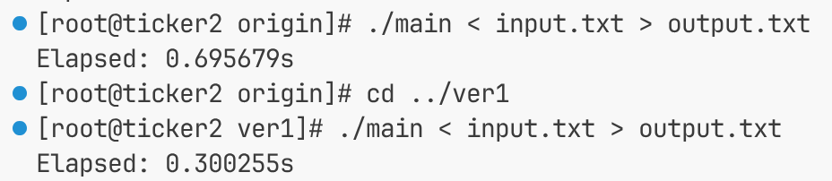
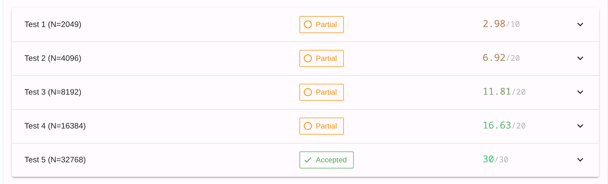
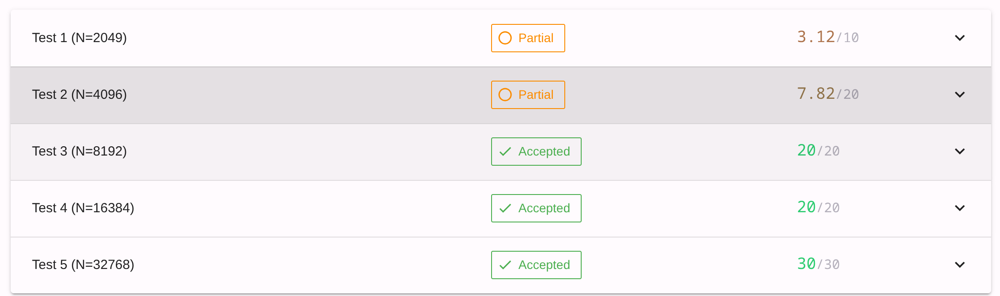

## Day 0 (+240 pts)
比赛是上午11点开始的, 但主包上午有事, 拖到下午才看

### 集群使用
HPCGame无论是测试代码or运行, 显然都需要在机房的集群上, 因此主包遇到的第一个难题就是如何登陆平台。

平台使用一个叫k8n的东西管理, 选手可以在上面创建叫容器的东西, 容器类似电脑, 可以写&跑代码。不过运行程序时需要写启动脚本, 之后交给集群排队, 查看结果似乎也很麻烦, 等到用的时候再学吧。

这届HPC给主包这样的新手们准备了一个客户端, 一键配置k8n连接。主包试了一下, 发现需要自己先下载一个叫kubectl的东西, 下载时还需要换源。然后去HPC平台创建k8的config文件, 一键配置时粘贴进终端就行了。

修改了一下创建容器的指令模板, 报错了。把参数写详细之后又成功了, 奇怪。

成功创建第一个容器, 每个容器只能持续2h, 之后会被删除, 连同其中数据。不过主办方提供了根目录的文件夹`/partition-data/`, 可以实现持久化, 每个集群(机房?)的每个选手的所有容器共享一个文件夹

---

### [T0-quine程序](https://hpcgame.pku.edu.cn/org/2df8f692-0316-4682-80cd-591732b1eda6/contest/e8ee3e65-0bc9-4122-82c0-e5be2614dbd1/problem/d38c6829-c067-4c0c-8a21-329fd6f7ff3a)

题目很有趣, 给了一段乱七八糟的程序, 让我们判断是什么语言并给出运行的结果
G老师回答是一种闻所未闻的语言, 不过程序很有趣: 它在不读取自身源文件的情况下得到与自身源代码相同的运行结果。

不过不知为何, 主包在本地的运行结果和源代码略有区别, 导致第一次WA, 第二次把源代码直接复制粘贴后AC了

---

### [T1-小北问答超速版](https://hpcgame.pku.edu.cn/org/2df8f692-0316-4682-80cd-591732b1eda6/contest/e8ee3e65-0bc9-4122-82c0-e5be2614dbd1/problem/a4c4cbe1-6d02-48f4-8956-fd8929ebf4e6)

一堆关于HPC的填空/简答/多选题
边学边做, 内容有点多学不进去了, 先拿40分

---

### [T2-ticker](https://hpcgame.pku.edu.cn/org/2df8f692-0316-4682-80cd-591732b1eda6/contest/e8ee3e65-0bc9-4122-82c0-e5be2614dbd1/problem/6d742dea-3847-4523-8181-7f1ab3d08448)

题目考察对"伪共享"(多个线程修改同一个cache line时被迫串行)的理解以及鲲鹏920的特质。

具体来说, 本题的结构体内含3个double加1个long long, 为32byte, 是一般x86平台cache line的大小的一半, 但在鲲鹏920, cache line的大小为其他平台的两倍, 导致每个cache line包含四个结构体, 被四个线程修改, 因此导致伪共享。

修改方法很简单: 在声明结构体时指定`alignas(128)`并通过加上`long long padding[12]`补足大小即可



可以看到速度提升了一倍

---

**一些趣事**
主包在写这道题时没看到这道题需要16个核心, 创建容器时只开了一个核心, 优化了两个小时也跑不进及格线(并行对单核显然是负优化), 打算随便提交一下拿点签到分, 不料直接AC, 方知容器开错了

---

## Day 1 (+85.19 pts)

下午两点回到酒店, 开始看T4
### [T4-Hyperlane Hopper](https://hpcgame.pku.edu.cn/org/2df8f692-0316-4682-80cd-591732b1eda6/contest/e8ee3e65-0bc9-4122-82c0-e5be2614dbd1/problem/478af5c4-989b-41e9-bd14-4048fae6cea6)

HPC中的经典老番: 如何将**单源最短路并行化**
在Dijkstra算法里, 每次松弛都需要读写一个`priority_queue`, 因此难以进行并行
考虑把每次操作的点从"最近的一个"换成"较近的几个", 主包有了想法

可以每次并行操作**距离不长于最近点距离+delta**的若干个点, 不过这样有几个问题
- 如果更新某一个点影响了该轮被操作的另一个点, 被影响的点需要重新被操作一次
	解决方案: 每轮将被影响的点放回, 持续操作直至没有这样的点
- Delta怎么取
	Gemini的建议是`L/d`, 其中L为平均边长, d为平均度数

接下来考虑怎么**存图**
问Gemini灵感时其提到了CSR, 即用数组存每条边的终点和权重, 同时把它们按照起始点排序
主包最初打算先全存, 再快排。Gemini提示可以统计每个起点的边数+前缀和, 把`O(nlogn)`优化成了`O(n)`

之后考虑优化
首先, 注意到**长度大于delta的边不会影响同一轮被操作的其他点**, 因此可以先迭代处理短边, 再一次处理完长边, 这要求存边时短边在前, 长边在后

不知道为什么, 在提交时跑的比测试镜像上更快
主包花了3h完成这些, 目前满分150pts只拿了一半分数, 以后再想怎么优化吧
目前T5不知为什么还是全员爆零, 明天可以考虑一下接着学T2 or 优化T4 or 看看T6,7

---

晚上回来, 看一眼后面的题
T5已经有AC, 同时T8开放了。目前满分1000, 大多数人还没提交T8, 故榜一为900分

不是, 什么叫做T5让我解决编译依赖问题?
题面明确说了节点是华为920, 或许可以搜搜它的神秘小特性

T6是实现并行矩阵乘法, 不考虑性能应该不会太难

T7是训练大模型中的一个步骤, 说是求一组训练序列的loss
主包现在连题面都读不懂, 等有时间搜一下这些名词是什么意思

T8是关于CUDA的, 出题团队贴心地为我们准备了一种较简单的语言, 不过这也导致题面有4k多字
题面是让我们通过这种方式复现一个叫"Flash Attention"的算法, 主包感觉大概率也会面对读不懂题的问题(笑)

---

## Day 2 (+0 pts)

和同学启动了一天MC, 没动题

---

## Day 3 (+5.15 pts)

早上7:30起来, 看看T6
### [T6-小北买文具](https://hpcgame.pku.edu.cn/org/2df8f692-0316-4682-80cd-591732b1eda6/contest/e8ee3e65-0bc9-4122-82c0-e5be2614dbd1/problem/9af9e15a-7e9c-4c9b-8ed4-6d6f2433dd63)

T6让选手完成矩阵的LU分解, 是CPU并行题
主包先考虑朴素的高斯消元, 发现无法并行, 原因是给前面行/列消元时会影响到后面的列/行。询问了Gemini, 其给出把矩阵分块的建议。设矩阵大小为N, 每一块大小为B

首先, 我们先对左边 $N * B$ 做朴素消元
第二步, 我们根据算出的L更新右侧的 $B*(N-B)$, 每个点复杂度为 $O(B)$ 且共有 $N* B$ 个点
第三步, 更新右下角的 $(N-B)*(N-B)$, 每个点复杂度为 $O(B)$ 且共有 $(N-B)^2$ 个点
以上三步会循环 $N/B$ 次

其中只有第一步需要串行, 后面占主要计算量的两步都可以并行, 因此串行的计算量从 $O(N^3)$ 降为 $O(N^2*B)$ 

之后考虑主元为0的情况, 因此需要换行。实现很容易, 不多赘述

交了一下, 居然RE了, 可惜待会要坐飞机回老家, 等到家了再看

---

晚上10:45到家, 看看为什么RE
比赛发的包里贴心准备了一个测试脚本 `run_judge.sh`, 不过好像看不到RE, 只能看到TLE
DIY了一下, 把本地测试限时延长几倍, 现在能看到确实是RE
看起来是换行时只检查了一个块内的行, 应该检查从当前行一直到N, 当块内只有0即UB
修了之后还是RE, 看来有一些更复杂的问题
问了一下Gemini, 原来是第三步出了问题
第三步更新每个点都需要进行B次减法, 我在外层循环用了 `collapse(2)`, 把二维循环展成一维, 这导致这B次减法可能被分配给不同进程, 导致Race condition

之前为了满足内存连续性, 我先循环`row`, 再循环 `i`, 最后才循环 `col`, 因此 `collapse(2)` 会导致不同线程修改同一个数据
把 `i` 和 `col` 对调后, 每个线程只负责一个数据, 因此可以安全使用 `collapse(2)`

提交了一下, 现在至少答案是对的, 但性能太FW了, 满分150才拿到5分多, 明天需要把速度优化8倍左右

## Day 4 (+116pts)

思考一下怎么优化
两个想法, 第一个是简单的循环展开
第二个是在第三步**建立一个缓存区存矩阵局部转置**, 这样列访问也能满足内存一致性

如果题目只考察想法一显然太简单了, 故主包打算先实现第二个想法

(写代码)

又交了一次, 这次拿到了 2/3 的分数
?
不是, 什么叫大数据点满分, 小数据点反而超时



看了一下详细结果, 前几个点用时需要减半, 应该好办

如果加上想法一的循环展开, 应该就能AC

循环展开全是体力活, 不想写了, Gemini, 启动



666, 要不我把 `N <= 4096` 的情况直接特判了得了

```
"T6是实现并行矩阵乘法, 不考虑性能应该不会太难"
```

我是怎么敢说这话的

万策尽矣, 问G老师给点思路

无脑Vibe了两个小时, 全是负优化, T6先这样吧

---

## Day 5 (+0 pts)

又是摆烂的一天, 什么也没干

---

## Day 6

今明两天回老家, 一看比赛明天晚上结束直接天塌了

白天走亲戚, 晚上8点开始HPC

先想一想做哪道题, 目前比较可做的有
- T2边学边做
- T4的SSSP优化
- T5, 一道有意思的题, 让选手给OPENBLAS提交一个补丁, 从而解决一个边界判断的bug, 如果注意力足够应该性价比很高
- T8, 也是很有意思的题, 用GPU编程语法实现三个简单的算子和Flash Attention, 可以拿完部分分直接走人

想了一下, 贪一波T5

### [T5-哪里爆了](https://hpcgame.pku.edu.cn/org/2df8f692-0316-4682-80cd-591732b1eda6/contest/e8ee3e65-0bc9-4122-82c0-e5be2614dbd1/problem/da813de5-74ef-472d-9657-690367bc380f)

920f好像人满为患了, 建立测试容器一直失败
在本地试着调试吧

先在`OpenBLAS`文件夹里找到`ssyrk`函数
哦在这个文件`/kernel/arm64/ssyrk_direct_alpha_beta_arm64_sme1`
看看怎么个事
草这是什么, 我怎么全都看不懂

SME指令是什么, ZA寄存器是什么, 外积运算是什么, 掩码是什么, 为什么c文件里面会有汇编代码

这道题让LLM写吧, 我真啥也不会

交了一次, 显示WA
```
Failed to run session: watchJob: pullJobLogs: processMessage: format not recognize
```
看起来评测机出了点问题

---

看了一下后面的题, 只有T8题干是主包能看懂的
感觉与其做LLM的Agent, 不如去看几集CSAPP, 或者学一学T2的知识

打算明天看看T8, 了解一点GPU编程, 之后就不再浪费时间做复制粘贴的工作了
(才不是因为发现自己不可能获奖)
